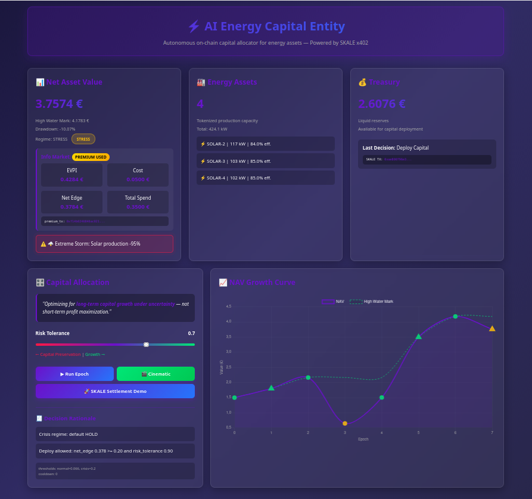

# ⚡ AI Energy Capital Entity — Autonomous On-Chain Energy Allocator



> An autonomous economic agent that treats **information as a tradable commodity** — buying premium forecasts only when their marginal value exceeds cost, surviving crises via drawdown-aware policy, and settling capital deployments on-chain via **SKALE**.

---

## 🌐 Live Demo

🔗 **Cloud Run Deployment**:  
[https://autonomous-energy-agent-xxx.a.run.app/dashboard](https://autonomous-energy-agent-1046541435067.europe-west1.run.app/dashboard)

*(Deployed on Google Cloud Run — containerized FastAPI + SKALE integration)*

---

## 🚀 Why This Matters (Hackathon Fit)

| Dimension | What We Deliver |
|-----------|-----------------|
| **AI Readiness** | Decision policy conditioned on risk tolerance, market regime, drawdown, and info edge — with full rationales exposed for auditability |
| **Commerce Realism** | True pay-per-call economics: agent spends treasury to buy premium forecasts when **EVPI > cost** — otherwise uses free signals |
| **Sponsor Integration** | ✅ **SKALE**: micropayments + on-chain settlement (tx links in UI)<br>✅ **Google Cloud**: production-ready deployment on Cloud Run |
| **Narrative Power** | Cinematic storyboard demo (warmup → premium → shock → recovery) that *shows* autonomous resilience — perfect for judges |

---

## 🧠 Core Innovation: Information Arbitrage

Traditional agents use static forecasts. Ours **dynamically trades information**:

```
IF  EVPI(premium_signal) > PREMIUM_COST 
AND cash_buffer_safe 
AND not_in_survival_mode
→ BUY premium signal (via SKALE micropayment)
→ Use superior forecast for capital allocation
ELSE
→ Use free (noisier) forecast
```

This creates a **self-funding intelligence loop**: better decisions → higher NAV → more treasury → ability to buy better signals.

---

## 📦 Repo Structure

```
autonomous-energy-agent/
├── main.py                # FastAPI app + portfolio state + endpoints
├── agent.py               # Crisis detection, EVPI calc, investment policy (+rationales)
├── environment.py         # Simulated energy market (solar prod, price, crises)
├── skale_payment.py       # SKALE micropayment helper (x402-style)
├── templates/
│   └── dashboard.html     # Control room UI (NAV curve, info market, assets)
├── Dockerfile             # Cloud Run container config
├── requirements.txt       # Dependencies
└── README.md              # You are here
```

---

## ⚙️ Run Locally

### Prerequisites
- Python 3.10+
- SKALE testnet RPC URL + funded wallet (for on-chain tx)
- `uvicorn` for local dev server

### Setup
```bash
python -m venv venv
source venv/bin/activate  # Windows: venv\Scripts\activate

pip install -r requirements.txt
cp .env.example .env
# Edit .env with your SKALE RPC + private key (or set ENABLE_ONCHAIN=false for simulation-only)
```

### Launch
```bash
uvicorn main:app --reload --host 0.0.0.0 --port 8000
```

### Key Endpoints
| Endpoint | Method | Description |
|----------|--------|-------------|
| `/dashboard` | GET | Control room UI (NAV curve, assets, info market) |
| `/epoch` | POST | Run one allocation epoch (`{"risk_tolerance": 0.7}`) |
| `/cinematic/run` | POST | Run full storyboard demo (warmup → shock → recovery) |
| `/cinematic/stream` | GET | SSE stream for live cinematic logs |
| `/x402/pay` | POST | Trigger SKALE micropayment (premium signal purchase) |
| `/demo` | POST | Trigger SKALE settlement demo (capital deployment) |

---

## ☁️ Deploy to Google Cloud Run

### Build & Deploy
```bash
gcloud run deploy autonomous-energy-agent \
  --source . \
  --region europe-west1 \
  --allow-unauthenticated \
  --set-env-vars="ENABLE_ONCHAIN=true,SKALE_RPC_URL=https://your-skale-rpc"
```

### Critical Environment Variables
| Variable | Required | Description |
|----------|----------|-------------|
| `ENABLE_ONCHAIN` | Yes | `true`/`false` — disable for simulation-only mode |
| `SKALE_RPC_URL` | Yes (if onchain) | SKALE testnet RPC endpoint |
| `PRIVATE_KEY` | Yes (if onchain) | ⚠️ Store in **Secret Manager** — never commit! |
| `MIN_CASH_BUFFER` | No | Default: `1.0` — safety buffer before deploying capital |

> 💡 **Pro Tip**: In Cloud Run, mount `PRIVATE_KEY` via Secret Manager as a volume — never pass as plain env var.

---

## 🎬 Cinematic Demo: The "Judge-Proof" Storyboard

Run `/cinematic/run` to trigger a **pre-scripted narrative** that demonstrates autonomy:

1. **Warmup (2 epochs)** → Build High-Water Mark (makes drawdown meaningful)
2. **Info Market** → Agent *chooses* to buy premium signal (EVPI > cost)
3. **Shock** → Forced `grid_failure` crisis (blackout penalty)
4. **Recovery (3 epochs)** → Agent survives via cash buffer + regime-aware policy
5. **Settlement** → On-chain SKALE tx proving capital deployment

✅ **Why judges love this**: No "trust us" — the UI *shows* the agent surviving a crisis *because* it bought better information earlier.

---

## 🔍 How the Policy Works (Decision Rationale)

The agent's `investment_policy()` outputs **human-readable rationales** visible in the dashboard:

```python
rationale = [
  "✅ Drawdown (-2.1%) above survival threshold (-15.0%)",
  "✅ Cash buffer (1.82€) > min required (1.0€ + deploy 0.5€)",
  "✅ Net info edge positive (0.032€) — premium signal justified",
  "✅ Crisis cooldown elapsed (last deploy at step 8, now step 15)",
  "🎯 DECISION: deploy_capital — favorable risk/reward in recovery phase"
]
```

This makes the AI **auditable** — critical for regulated domains like energy finance.

---

## ⚠️ Troubleshooting

| Issue | Solution |
|-------|----------|
| `ValueError: Web3 connection failed` | Set `ENABLE_ONCHAIN=false` for simulation-only mode |
| SKALE tx stuck | Ensure wallet has testnet ETH (faucet: https://faucet.skale.network) |
| Dashboard chart empty | Run at least 1 epoch (`POST /epoch`) to generate NAV history |
| `402 Payment Required` on `/premium/signal` | Must call `/x402/pay` first to generate valid tx_hash |

---

## 📜 License

MIT — feel free to fork, adapt, and deploy. Attribution appreciated.

---

## 💡 Team & Contact

Built with ❤️ for **SKALE × Google Cloud Hackathon 2026**  

---

> *"The best energy allocator isn't the one with the most capital — it's the one that buys the right information at the right time."*
```
